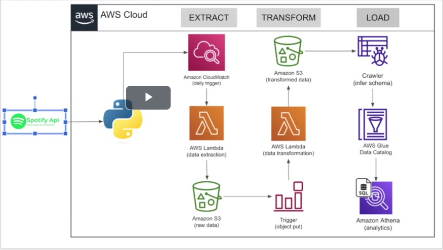

# Spotify End-to-End ETL Pipeline

This project aims to create an ETL (Extract, Transform, Load) pipeline for extracting data from the Spotify API, transforming it, and storing it in a target location. The pipeline will handle the extraction of music-related data from Spotify, perform necessary transformations, and load the processed data into a specified storage location.

## Objective

The goal of this project is to build a robust and scalable ETL pipeline that can:

- Connect to the Spotify API securely.
- Extract relevant data, such as music artists, albums, and tracks.
- Transform the raw data into a structured format suitable for analysis and storage.
- Load the transformed data into a target location (e.g., AWS Glue).
- Utilize AWS Athena for accessing and performing further analysis on the data.

## Technologies Used

- Python
- AWS Services:
  - AWS CloudWatch
  - AWS Lambda
  - Amazon S3
  - AWS Glue
  - AWS Athena

## Project Structure

The project is structured as follows:

